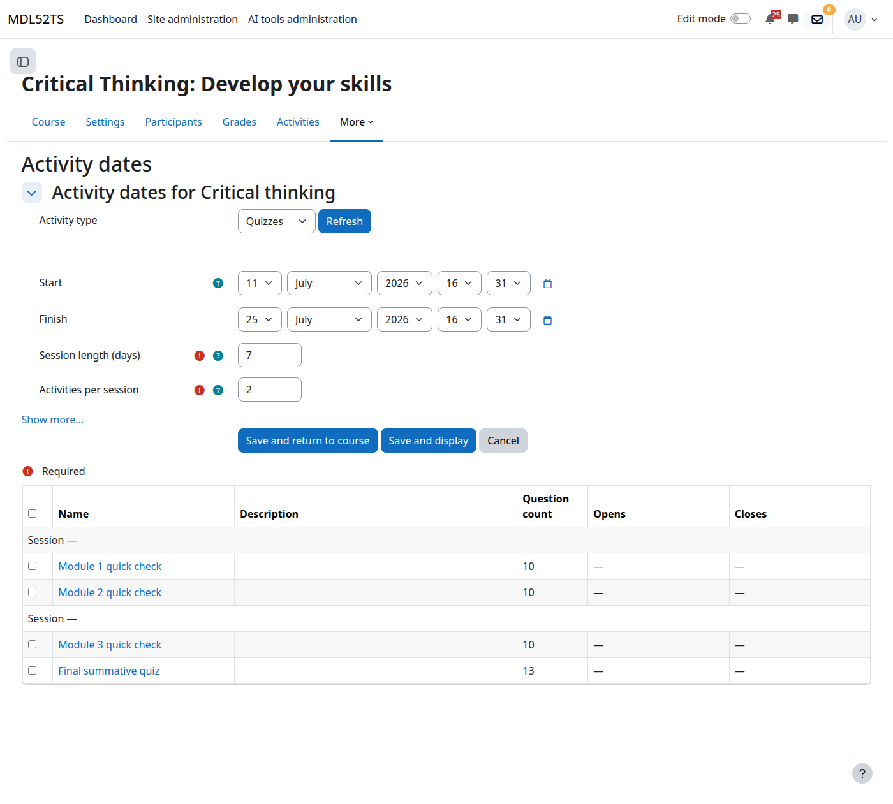
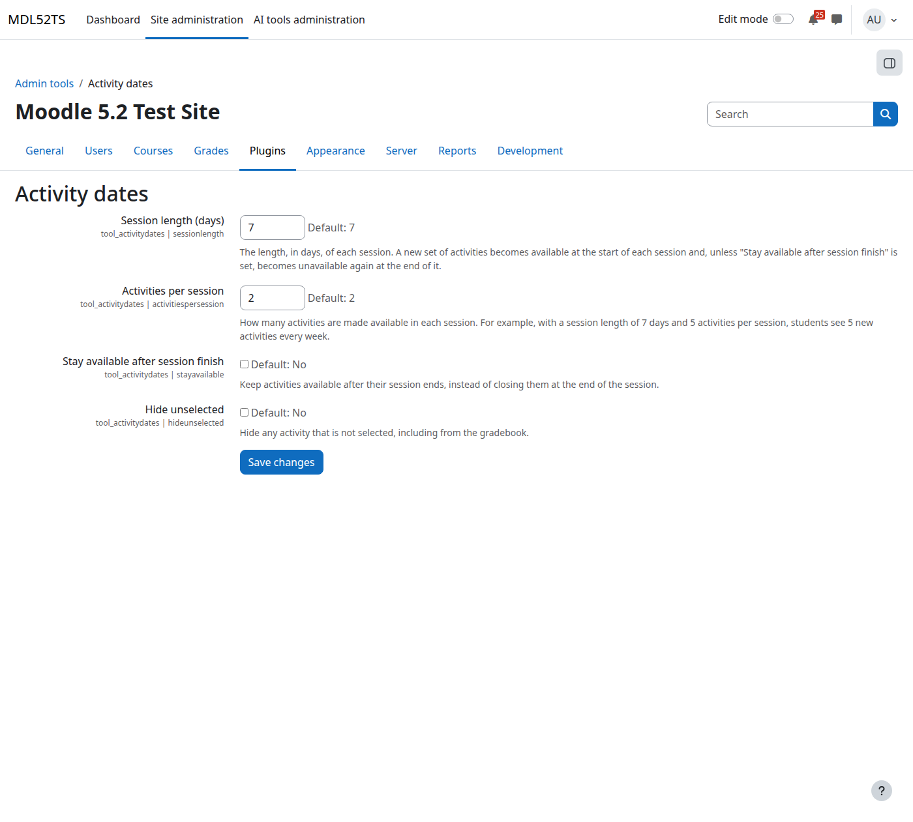

# Activity dates — User documentation

`tool_activitydates` is a Moodle admin tool that bulk-schedules the **open and close dates** of a course's activities on a timed-session basis. Instead of setting each quiz, choice or feedback's dates by hand, you pick a group of activities of one type, split them into evenly-spaced sessions, and let the tool write each session's window straight into the activities' own date fields.

## Background

### The problem it solves

A common teaching pattern is *drip release*: make a batch of activities available for a week, then the next batch the week after, and so on. Doing this by hand across a course full of quizzes means opening every quiz's settings, typing an open date and a close date, saving, and repeating — tedious and easy to get wrong.

### How it differs from Driprelease

The scheduling idea is adapted from [Driprelease](https://moodle.org/plugins/tool_driprelease) by Marcus Green. The important difference:

- **Driprelease** controls access with *availability restrictions* (the "Restrict access" mechanism). The activity's own dates are untouched; access is gated by a condition.
- **Activity dates** writes each activity's **own `timeopen` / `timeclose` fields**. Students get the native "Opens:" / "Closes:" display, real calendar events, and the module's built-in date behaviour — with no restriction rules involved.

### What counts as an eligible activity

A module type is eligible only if its instance table has **both** a `timeopen` and a `timeclose` column. In a standard Moodle that includes **Quiz, Choice, Feedback, SCORM package, Lesson, Workshop, Chat** and similar. Types without those columns (e.g. Page, Label, URL) never appear. The tool checks the columns live, so third-party modules with the same columns are picked up automatically.

## Requirements

- Moodle 5.0 or later.

## Installation

1. Copy the plugin directory into `<moodleroot>/public/admin/tool/activitydates/`.
2. Visit **Site administration → Notifications** and complete the upgrade.

## Who can use it

Users with the `tool/activitydates:manage` capability in the course. By default that is **editing teachers** and **managers**. The capability carries a `RISK_DATALOSS` warning because applying dates bulk-overwrites the activities' open/close dates.

## Using the tool

### 1. Open it

From within a course, go to the course administration menu and click **Activity dates**. (There is no site-wide entry point — the tool always runs in the context of one course. Hitting the plugin's `index.php` directly just redirects to the admin index.)

If the course has no activities that support open/close dates, you get a notice and nothing else to do.

### 2. Choose the activity type

Pick the **Activity type** (e.g. Quizzes) from the dropdown and press **Refresh** to load that type's activities into the table below. Only one type is scheduled at a time; each type keeps its own selection.

### 3. Set the schedule window and session settings

| Field | Meaning |
|-------|---------|
| **Start** | When the first session opens. |
| **Finish** | The end of the overall scheduling window. No activity is scheduled to open after this. |
| **Session length (days)** | Length of each session. A new batch of activities opens at the start of each session and (unless *Stay available* is set) closes at the end of it. |
| **Activities per session** | How many activities go in each session. E.g. 7-day sessions + 5 per session = 5 new activities each week. |

Advanced options:

| Option | Effect |
|--------|--------|
| **Stay available after session finish** | Write an open date but **no** close date, so activities stay open once opened. |
| **Hide unselected** | Any activity of this type left unticked is hidden (including from the gradebook). |
| **Reset unselected** | Clear the open/close dates of any unticked activity and delete its calendar events. |

### 4. Select activities

Tick the activities you want scheduled in the table. The header rows show the session number and its computed **Opens – Closes** window; each activity row shows its current open/close dates so you can see what will change. Use the header checkbox to select/deselect all.

Activities are split into sessions **in course order** — the order they appear on the course page — in chunks of *Activities per session*.

### 5. Save or refresh

- **Refresh** (next to the type dropdown) — re-renders the table for the chosen type and **saves your settings and selection** without applying any dates. Use it to preview the session windows.
- **Save and display** — persists settings/selection, **applies the dates**, and stays on the page.
- **Save and return to course** — same, then returns to the course.
- **Cancel** — discards and returns to the course.

On a save that applies dates you get a "Updated dates for N of *type*" confirmation.

## What "apply" actually does

For every **selected, in-window** activity:

- Sets `timeopen` to its session's start and `timeclose` to its session's end (or leaves close at 0 if *Stay available* is on).
- Makes the activity visible.
- Recreates its open/close **calendar events**.
- Triggers a `course_module_updated` event.

For **unselected** activities: hidden if *Hide unselected* is on (otherwise shown); dates cleared and calendar events deleted if *Reset unselected* is on.

Anything scheduled to open after the **Finish** date is skipped — both in the preview and on apply — so you never see a window the tool would refuse to write.

## Site-wide defaults

**Site administration → Plugins → Admin tools → Activity dates** sets the defaults new courses start with:

- Session length (default **7**).
- Activities per session (default **2**).
- Stay available after session finish (default off).
- Hide unselected (default off).

These only seed the form; each course then stores its own configuration.

## Validation rules

The form rejects a save when:

- Start-to-finish is less than one day.
- Session length is longer than the start-to-finish window.
- Activities per session is below 1 or larger than the number of eligible activities.

## Privacy

The tool stores only **course-level scheduling configuration** — the chosen activity type, session settings, and which course modules are selected. It stores **no personal user data** and implements Moodle's `null_provider`.

## Data stored

- `tool_activitydates` — one configuration row per course.
- `tool_activitydates_cmids` — the selected course-module IDs for that configuration.

## License

GNU GPL v3 or later — https://www.gnu.org/licenses/gpl-3.0.html
