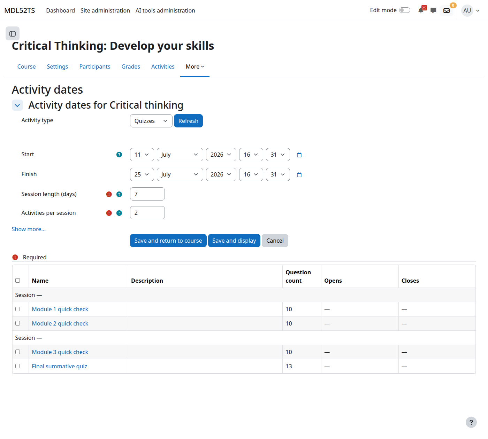
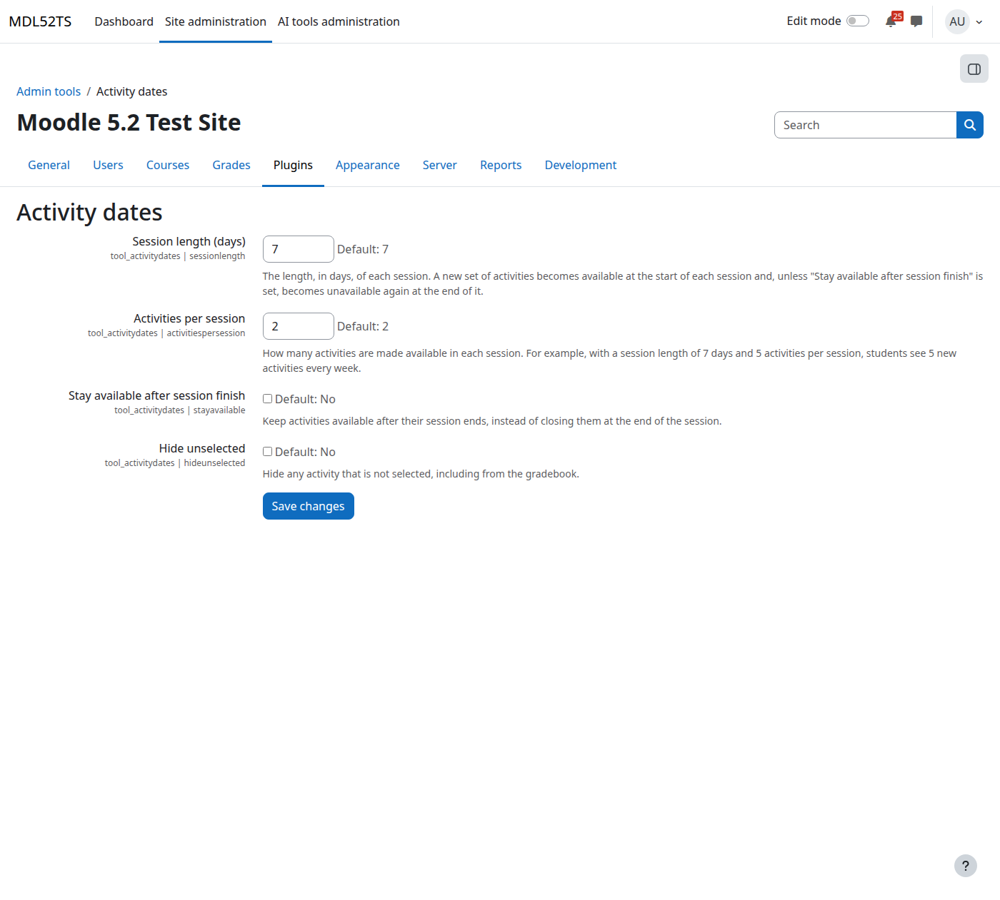

# Activity dates — User documentation

`tool_activitydates` is a Moodle admin tool that bulk-schedules the **open and close dates** of a course's activities on a timed-session basis. Instead of setting each quiz, choice or feedback's dates by hand, you pick a group of activities of one type, split them into evenly-spaced sessions, and let the tool write each session's window straight into the activities' own date fields. On the same page it can also schedule each activity's **gradebook lock date**, with an optional note that tells students when their grades lock.

## Background

### The problem it solves

A common teaching pattern is *drip release*: make a batch of activities available for a week, then the next batch the week after, and so on. Doing this by hand across a course full of quizzes means opening every quiz's settings, typing an open date and a close date, saving, and repeating — tedious and easy to get wrong.

### How it differs from Driprelease

The scheduling idea is adapted from [Driprelease](https://moodle.org/plugins/tool_driprelease) by Marcus Green. The important difference:

- **Driprelease** controls access with *availability restrictions* (the "Restrict access" mechanism). The activity's own dates are untouched; access is gated by a condition.
- **Activity dates** writes each activity's **own `timeopen` / `timeclose` fields**. Students get the native "Opens:" / "Closes:" display, real calendar events, and the module's built-in date behaviour — with no restriction rules involved.

### What counts as an eligible activity

A module type is eligible only if its instance table has **both** a `timeopen` and a `timeclose` column. In a standard Moodle (5.0 to 5.3) those are **Quiz, Choice, Feedback and SCORM package**. Lesson and Workshop use differently named date columns, so they are not offered. Types without those columns (e.g. Page, Label, URL) never appear. The tool checks the columns live, so third-party modules with the same columns are picked up automatically.

For grade locks, a type is eligible if its activities have gradebook grade items (e.g. Quiz, Assignment). A graded type without the date columns, such as Assignment, is offered for its lock dates only.

## Requirements

- Moodle 5.0 or later.

## Installation

1. Copy the plugin directory into `<moodleroot>/public/admin/tool/activitydates/`.
2. Visit **Site administration → Notifications** and complete the upgrade.

## Who can use it

The page needs one of two capabilities in the course, and it shows and saves only what the user may change:

| Capability | Lets the user | Default holders |
|------------|---------------|-----------------|
| `tool/activitydates:manage` | Schedule open, due and close dates and set their **Hold** ticks; the hide and reset options for unselected activities. | Editing teachers and managers |
| `tool/activitydates:managelocks` | Schedule gradebook lock dates and the student notes: the **Grade locks** section, the **Locked** date and its **Hold** tick, and the **Grade-lock note** column. Cloned from `moodle/grade:manage`. | Editing teachers and managers |

Both carry a `RISK_DATALOSS` warning, because a save bulk-overwrites the activities' dates or the gradebook's lock dates. A user with neither capability gets the standard "no permission" error.

## Using the tool

### 1. Open it

From within a course, go to the course administration menu and click **Activity dates**. The entry is shown to users with either capability. (There is no site-wide entry point — the tool always runs in the context of one course. Hitting the plugin's `index.php` directly just redirects to the admin index.) Everything is on this one page; the old Grade locks page address (`locks.php`) now redirects to it.

If the course has no activity the user can schedule, you get a notice and nothing else to do.

### 2. Choose the activity type

Pick the **Activity type** (e.g. Quizzes) from the dropdown. Changing the type previews that type's activities in the table below straight away; the **Preview** button next to the dropdown does the same. Only one type is scheduled at a time; each type keeps its own selection.

The dropdown offers two kinds of type, and only those the user can act on:

- **Types with dates** — their instance table has both `timeopen` and `timeclose` (in a standard Moodle: Quiz, Choice, Feedback and SCORM package). They need `:manage`. If they also have gradebook grade items (e.g. Quiz), a user with `:managelocks` can schedule their lock dates too.
- **Lock-only types** — graded types without those date columns, for example **Assignments**. They need `:managelocks`, and for them only the **Locked** date is scheduled.

### 3. Set the schedule

The form shows, in this order:

1. **Activity type** and **Preview**.
2. **Schedule** — Start, Finish, Session length, Activities per session.
3. **Due dates** — only for activity types with a due date: in a standard Moodle that is the **quiz on Moodle 5.3 and later**. On Moodle 5.0 to 5.2 the quiz has no due date, so these settings and the table's Due date do not appear. (The tool checks for the `duedate` column, not the Moodle version.) Needs `:manage`.
4. **Close dates**. Needs `:manage`.
5. **Grade locks** section. Needs `:managelocks`. It is collapsed while its lock option is **No lock**.
6. **Advanced** — Hide unselected, Reset unselected. Needs `:manage`.
7. The buttons. They sit below every section, so they stay visible when **Advanced** or **Grade locks** is collapsed.

The open date has no settings of its own: each activity opens at the start of its session.

| Field | Meaning |
|-------|---------|
| **Start** | When the first session opens. |
| **Finish** (tick **Enable** to use it) | Optional cap, **off by default**. When enabled, no session that starts after it is scheduled, so any activities left over are not scheduled. It does not move any close, due or lock date. When disabled, every selected activity is scheduled. |
| **Session length (days)** | Length of each session. A new batch of activities opens at the start of each session. |
| **Activities per session** | How many activities go in each session. E.g. 7-day sessions + 5 per session = 5 new activities each week. |
| **Due dates** / **Days until due** / **Due all on** | How each activity's due date is set (see below). The days and date fields show only for the *After a number of days* / *All on a date* options. |
| **Close dates** / **Days until close** / **Close all on** | How each activity's close date is set, likewise. |

Close, due and lock dates each offer four options:

| Option | Close, due or lock date |
|--------|-------------------------|
| **After a number of days** | That many days after the activity opens. Days are counted in your own timezone, so "+7 days" keeps the same time of day across a daylight-saving change. |
| **At the end of this session** | When the next session opens (the open date plus the session length). The last session ends the same way. |
| **All on a date** | The same date and time for every activity. |
| **No date** (for locks: **No lock**) | No close or due date: with no close date, activities stay available once opened. For locks, **No lock** means the tool leaves every existing grade lock as it is. |

Due dates must fall after the open date and no later than the close date, as in the quiz's own settings. A held date can suit early sessions but not later ones, so this is checked for each row of the table when you save (see step 5).

**Grade locks section:**

| Field | Meaning |
|-------|---------|
| **Lock grades** / **Days until locked** / **Lock all on** | How each selected activity's gradebook lock date is set, with the four options above. Days count from the activity's open date (its session start, or its held open date). |
| **Clear the locks of unselected activities** | Clear the gradebook lock date of every activity of this type that is not ticked. This applies whatever the lock option, including **No lock**. |

The student notes are chosen for each activity in the table's **Grade-lock note** column (step 4).

**Advanced:**

| Option | Effect |
|--------|--------|
| **Hide unselected** | Any activity of this type left unticked is hidden (including from the gradebook). |
| **Reset unselected** | Clear the open, close and (where the type has one) due dates of any unticked activity and delete its calendar events. |

### 4. Select activities and preview the dates

When the page opens, and again after a save, the table shows each activity's **current** dates. Tick the activities you want scheduled, then press **Preview** to fill the table with the proposed dates. The header rows show the session number and its **Opens – Closes** window. The table's columns are:

- the selection tick (the header checkbox selects or clears them all), the name, the description, and for quizzes the **Marks** (the quiz's maximum grade);
- **Dates** — one column that stacks, for each activity, **Open**, **Due** (only for types with a due date, i.e. quizzes on Moodle 5.3 and later), **Close** and **Locked** (with `:managelocks`, for an activity type with gradebook grade items; the lock date is read live from the gradebook). Each date is an editable field with its own **Hold** tick and room for an error message;
- **Grade-lock note** (with `:managelocks`, for an activity type with gradebook grade items) — two ticks per activity, **Activity page** and **Course page**, each with a header checkbox that switches them all (see *Grade lock notes* below). An activity without a grade item (such as a quiz with a maximum grade of 0) has no note ticks and no **Hold** tick on **Locked**;
- the status.

An empty date field means the date is not set. Which date fields are editable:

- Open, Due and Close need `:manage` and a type with dates. A lock-only type (e.g. Assignments) shows only Locked.
- Locked needs `:managelocks`, a lock option other than **No lock**, and an activity with a grade item.
- Only rows that are selected and scheduled are editable.
- Every other date field is shown greyed out (disabled) with the activity's current value, so with **No lock** the Locked field still shows each lock in force. A disabled field is not sent when you save.

Rows that are not scheduled show their status: **Not scheduled** (unticked, or past the finish date), **Will be hidden** (with *Hide unselected*) or **Dates will be reset** (with *Reset unselected*).

Activities are split into sessions **in course order** — the order they appear on the course page — in chunks of *Activities per session*.

**Preview saves nothing.** It recalculates the table from the settings and ticks on the page, and replaces every date that is not held with its proposal, including dates you had edited.

**Holding a date.** Tick **Hold** next to a date to keep it when you press **Preview**: the scheduler recalculates only the dates that are not held, and a held field keeps the value in the table, even when you change the settings. The activity still takes its place in its session. *After a number of days* (for due, close and lock dates) counts from the activity's held open date when its Open is held and set, otherwise from its session start; *At the end of this session* and *All on a date* are not affected. The Hold ticks are saved for each activity and date, and stay ticked until you untick them. They can be changed only on selected rows: the ticks of unselected activities are kept as they were saved. Holding Open, Due or Close needs `:manage`; holding Locked needs `:managelocks`.

**Editing the dates.** You can change any editable date in the table before saving; Save writes exactly what the table shows, so a save straight after the page loads writes the current dates back and changes nothing. **Every date may be left empty**, which means "not set": an empty Open or Close saves no open or close date, an empty Due saves no due date, and an empty Locked clears that activity's grade lock.

**Stale table.** If you change a setting or a selection tick after previewing, a bar above the table says "Settings changed. Press Preview to update the dates." and the Save buttons are disabled until you press **Preview**. The Hold ticks, the grade-lock note ticks and the *unselected* options do not do this, because they change no proposed date. The server checks this as well: if the settings saved do not match the ones the table was built from, nothing is saved, the dates are recalculated, and you are asked to check them and save again.

**Filtering by name.** Type in **Filter by name**, above the table, to show only the activities whose name contains that text (ignoring case), for example "reading". Session rows with no matching activity hide too. The select-all box and the two note select-alls then act on the activities shown only; hidden activities keep their ticks and are still saved with the page. The filter changes nothing that is saved and is cleared when the page reloads.

### 5. Save

- **Preview** (next to the type dropdown) — recalculates the table, saves nothing.
- **Save and display** — saves the settings, the selection, the Hold ticks and the note ticks, **writes the table's dates**, and stays on the page, which then shows the dates now in force.
- **Save and return to course** — same, then returns to the course.
- **Cancel** — discards and returns to the course.

Before anything is written, every editable row is checked, and only between dates that are set: Close must be after Open, and Due must be after Open and no later than Close. A lock date has no ordering rule, and may be in the past (the gradebook then locks the item on its next scheduled run). If any row fails, or a field is not a valid date, **nothing is saved**: the table keeps your edits, each wrong field is marked with its error, and a notice says how many dates need correcting.

A save that writes dates confirms "Updated dates for N of *type*"; one that writes lock dates confirms "Updated the gradebook lock date for N activities."

### Saved configurations

The collapsible **Saved configurations** section, above the Save buttons, keeps named copies of the page for this course:

- **Save configuration** saves everything the page shows under the name in **Configuration name**: the settings, the ticked activities, every date in the table, and the Hold and note ticks. It changes nothing in the course. Saving under a name the course already has replaces that configuration. If the settings changed since the last Preview, press **Preview** first, as for Save.
- **Load** fills the page with a configuration, as it was saved, and changes nothing in the course: check the dates, then press a Save button to apply them. Its name fills **Configuration name**, so saving again replaces it. Activities deleted since it was saved are left out, and a notice says how many; activities added since show unticked, with their current dates. A configuration for an activity type the course no longer offers does not load.
- **Delete** removes a configuration after you confirm. Activities and grades are not changed.

Configurations belong to the course and are shared by everyone who can open the page there. A user with only one of the two capabilities saves and loads only their part: the date settings and dates with `:manage`, the grade-lock settings, Locked dates and notes with `:managelocks`. The other part keeps the course's current values.

## What Save actually does

With `:manage`, for a type with dates, for every **selected, scheduled** activity:

- Sets `timeopen`, `timeclose` and, where the type has one, `duedate` to the values in its table row (an empty field writes 0, no date).
- Makes the activity visible.
- Recreates its open/close **calendar events**.
- Triggers a `course_module_updated` event.

The **Hold** ticks of Open, Due and Close are saved for every selected activity.

For **unselected** activities: hidden if *Hide unselected* is on (otherwise shown); dates (including the due date) cleared and calendar events deleted if *Reset unselected* is on.

With `:managelocks`:

- The lock settings, the selection and each selected row's **Activity page** and **Course page** note ticks are saved. An activity that is not selected has no note, and its note boxes show unticked; ticking the activity sets them to the site defaults (see [Site-wide defaults](#site-wide-defaults)).
- Unless the lock option is **No lock**, the lock date (`locktime`) of every grade item of each selected, scheduled activity is set to its **Locked** value; an empty value clears it. A **Locked** value left as the page showed it is not written, so an activity whose grade items have different lock dates (the page shows the earliest) keeps them. Moodle's own scheduled task (`\core\task\grade_cron_task`) then locks the items once that time has passed; nothing is locked at the moment you save. A selected activity without a grade item is skipped and not counted.
- With **No lock**, no lock date is written, so the locks already in the gradebook stay as they are.
- With **Clear the locks of unselected activities** on, the lock date of every unselected activity of the type is cleared (an item that is already locked stays locked).
- The page has one selection, but the dates and the grade locks each keep their own saved copy. With both capabilities, the ticks you see on loading are the dates selection. An activity that only the grade-lock selection holds (after the upgrade from 2.0, where the two tabs were selected separately, or after a save by someone with `:managelocks` only) therefore shows unticked, and saving leaves its grade-lock selection, notes and lock date as they are. Tick it to bring it into both selections; untick it again and save to remove it from both.
- The **Hold** ticks of Locked are saved for the selected activities.
- The plugin does not store lock dates itself: the gradebook's lock date is the only record, so a date changed in the gradebook's own settings shows up here too.

With the **Finish** date enabled, anything scheduled to open after it is skipped — both in the preview and on save — so you never see a window the tool would refuse to write. Only rows the table offers for editing can be written: a date sent for any other activity, or a field the user may not edit, is ignored.

## Grade lock notes: what students see

The notes are switched on per activity, in the table's **Grade-lock note** column. With **Activity page** ticked for an activity, students see on the activity page:

- before the lock date: **"Grades lock after {date}"**;
- once locked: **"Grades were locked on {date}"**.

If the activity has several grade items, the earliest date applies. On Moodle 5.2 and later the note sits in the activity header next to the activity's dates; on Moodle 5.0 and 5.1 it appears at the top of the page. Where the row's **Course page** tick is on as well, a compact copy of the note also appears under that activity on the course page — only for activities the student can see listed there, and only in course formats that use Moodle's standard activity layout. The course-page copy needs the **Activity page** tick too: an activity with only **Course page** ticked shows no note.

### Using it alongside Timelocker

The Grade locks section replaces the `tool_timelocker` plugin, but both can be installed on one site. Both write the same gradebook lock date, so for an activity scheduled in both, the last save wins, and both show the date actually in force. `tool_timelocker` 0.1.1 and later stays quiet on an activity where this plugin already shows a note, so students see one note. Nothing is migrated from Timelocker; its lock dates stay in the gradebook.

## Site-wide defaults

**Site administration → Plugins → Admin tools → Activity dates** sets the defaults new courses start with:

- Session length (default **7**).
- Activities per session (default **2**).
- Enable the session finish date by default (default **off**).
- Due dates (default **No date**) and Days until due (default **7**). These apply only to activity types with a due date.
- Close dates (default **At the end of this session**) and Days until close (default **7**).
- Hide unselected (default off).

A **Grade locks** heading on the same page holds the Grade locks section's defaults:

- Lock grades (default **No lock**) and Days until locked (default **7**).
- Show student note (default on) and Also show notes on the course page (default off): the starting state of a row's **Activity page** and **Course page** note ticks, for an activity with no saved note.

These only seed the form; each course then stores its own configuration.

## Validation rules

The form rejects a Preview or a save when:

- The finish date is enabled and start-to-finish is less than one day.
- The finish date is enabled and the session length is longer than the start-to-finish window.
- Session length is below 1.
- Activities per session is below 1 or larger than the number of activities of the type.
- *After a number of days* is chosen for close, due or lock dates and the number of days is below 1.
- *All on a date* is chosen for close, due or lock dates and the date is not after the start.

On save, each row of the table is also checked (see *Save* above): among the dates that are set, close after open, and due after open and no later than close.

## Upgrading from 2.0.0

- **One page.** The Grade locks tab is now the **Grade locks** section of the Activity dates page. Its **Locked** date joins the open, due and close dates in the table's **Dates** column, and its note ticks become the **Grade-lock note** column. Old links to the Grade locks page redirect.
- **One editable Dates column.** The table's **From** and **To** columns are replaced by the **Dates** column. Its fields show each activity's current dates until you press **Preview**, and each date has a **Hold** tick that keeps it through Preview. No date is held after the upgrade.
- **Notes per activity.** The Grade locks section's **Show student note** and **Also show notes on the course page** options are gone; each activity has its own **Activity page** and **Course page** tick. The upgrade keeps what students see: an activity whose note was on, in a course that also showed notes on the course page, gets its **Course page** tick.
- **Grade locks use the shared schedule.** The Grade locks tab's own schedule start, session length and activities per session (and their two site defaults) are gone; lock dates follow the page's schedule, with the four lock options. Every course starts with **No lock**, so the section is collapsed and the upgrade changes no lock date: locks already in the gradebook stay in force and show in the Locked field, and the per-activity notes are kept.
- The **Stay available after session finish** option is gone. The upgrade converts it: a course (or the site default) that had it on gets the close option **No date**, and every other course gets **At the end of this session**.
- **Behaviour change:** *At the end of this session* now closes an activity when the next session opens. In 2.0.0 it closed the day before, at the finish date's time of day.
- The finish date no longer sets the time of day at which sessions close; it is now only an optional cap, and it is off by default for courses without a saved configuration. Saved configurations keep their setting.
- On Moodle 5.3 and later, the quiz's due date is written with its open and close dates and kept between them. Existing course schedules start with **No date** for due dates.

## Privacy

The tool stores only **course-level scheduling configuration** — the chosen activity type, session and lock settings, which course modules are selected, their note ticks, and which of their dates are held. It stores **no personal user data** and implements Moodle's `null_provider`.

## Data stored

- `tool_activitydates` — one configuration row per course.
- `tool_activitydates_cmids` — the selected course-module IDs for that configuration.
- `tool_activitydates_lock` — one grade-lock configuration row per course (lock option, days, date, clear-unselected).
- `tool_activitydates_lockitem` — the course-module IDs selected for grade locks, each with its activity-page and course-page note switches.
- `tool_activitydates_saved` — the saved configurations: course, name, and a JSON copy of the page (settings, ticked activities, table dates, Hold and note ticks).
- `tool_activitydates_fixed` — the held dates: one row per course module and held field (`timeopen`, `duedate`, `timeclose` or `timelock`). It stores only the flag; the date itself stays in the activity or the gradebook.

Deleting a course deletes its rows from all six tables. Deleting an activity deletes its rows from `tool_activitydates_cmids`, `tool_activitydates_lockitem` and `tool_activitydates_fixed`.

## License

GNU GPL v3 or later — https://www.gnu.org/licenses/gpl-3.0.html
